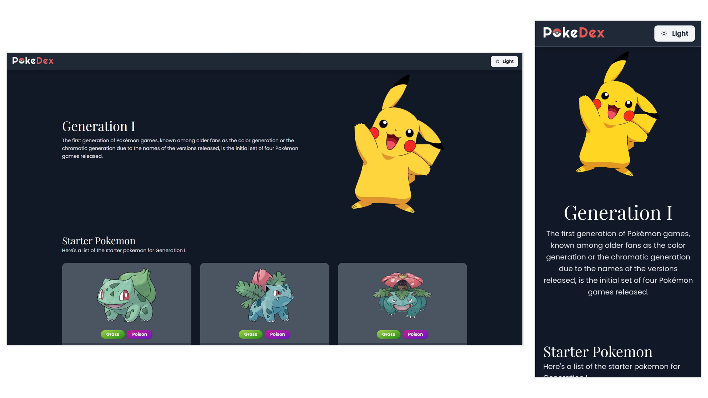

# React Pokedex

 &nbsp;&nbsp; 

## Contents

- [Technologies Used](#technologies-used)
- [Introduction](#introduction)
- [Home Page](#home-page)
- [Generation List Page](#generation-list-page)
- [Pokemon Detail Page](#pokemon-detail-page)
  - [Static Site Generation](#static-site-generation)
- [Dark Mode](#dark-mode)

## Technologies Used

| Name        | Description |
| ----------- | ---------------- |
| Next.js     | An open-source React front-end development web framework that enables functionality such as server-side rendering and generating static websites for React based web applications. |
| TailwindCSS | A utility-first CSS framework packed with classes that can be composed to build any design, directly in your markup. |
| TypeScript  | It is a strict syntactical superset of JavaScript and adds optional static typing to the language. |
| Poke API    | An API to consume information on Pokémon, their moves, abilities, types, egg groups and much, much more.|

## Introduction

This is a simple PokeDex application created using Next.js which is a React Framework for production. Next.js has various features that make it the ideal choice for a website with great SEO (Search Engine Optimization) and performance. Static Site Generation is a feature that Next.js comes with and it is great for generating webpages which have static content.

## Home Page

The HomePage displays a brief introduction for each pokemon generation and displays the starter pokemon for each generation along with their evolution. The website uses TailwindCSS for styling and each pokemon and its details are displayed in a card. Additionally, when the data is being loaded, skeleton cards are displayed as placeholders. This helps to improve the first-paint performance of the application.

## Generation List Page

This page displays a list of all pokemon in that generation. Since there are usually more than 100 Pokemon in each generation, a pagination system is implemented which displays 12 Pokemon at a time.

As displayed above, The user can choose to navigate to the next or previous batch of pokemon when viewing the list.

## Pokemon Detail Page

This page displays additional information about the pokemon. The stats such as hp, attack, defense, speed, etc. are displayed using progress-bar style meters. These have been designed using TailwindCSS.

### Static Site Generation

The Pokemon Detail Page uses static site generation which is a feature of Next.js. Essentially, all the pokemon detail pages are pre-rendered at build time. This means that when you open a page to view the information about a pokemon such as [pikachu](https://pokedex.sanketnaik.dev/pokemon/25) you are actually viewing a static page. This means that no API call is made to load the information related to Pikachu and the entire page has been pre-rendered in advance.

## Dark Mode

TailwindCSS 2.0 includes features for implementing dark mode for applications and this has been used to make the entire application dark mode compatible. When the user taps on the dark mode toggle, all elements of the website transition from a light theme to a dark theme with a smooth transition animation. The screenshots of all pages in dark mode are provided below.

